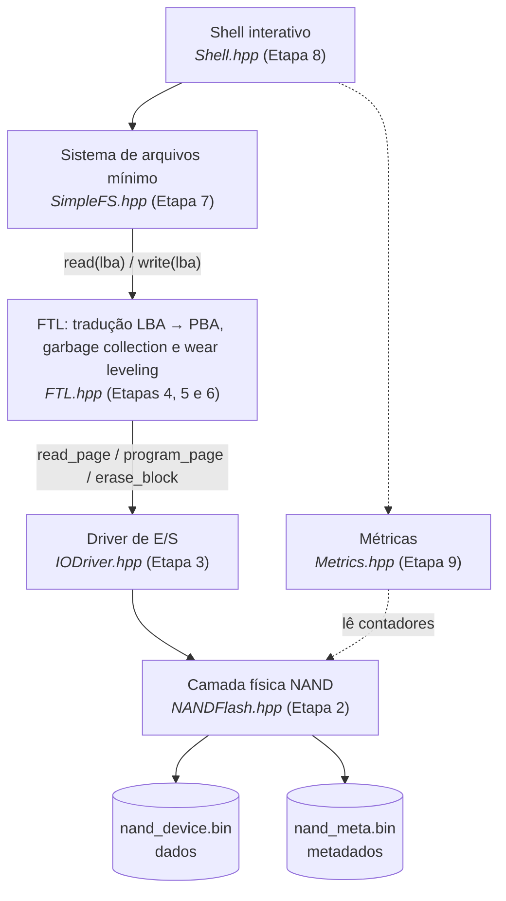
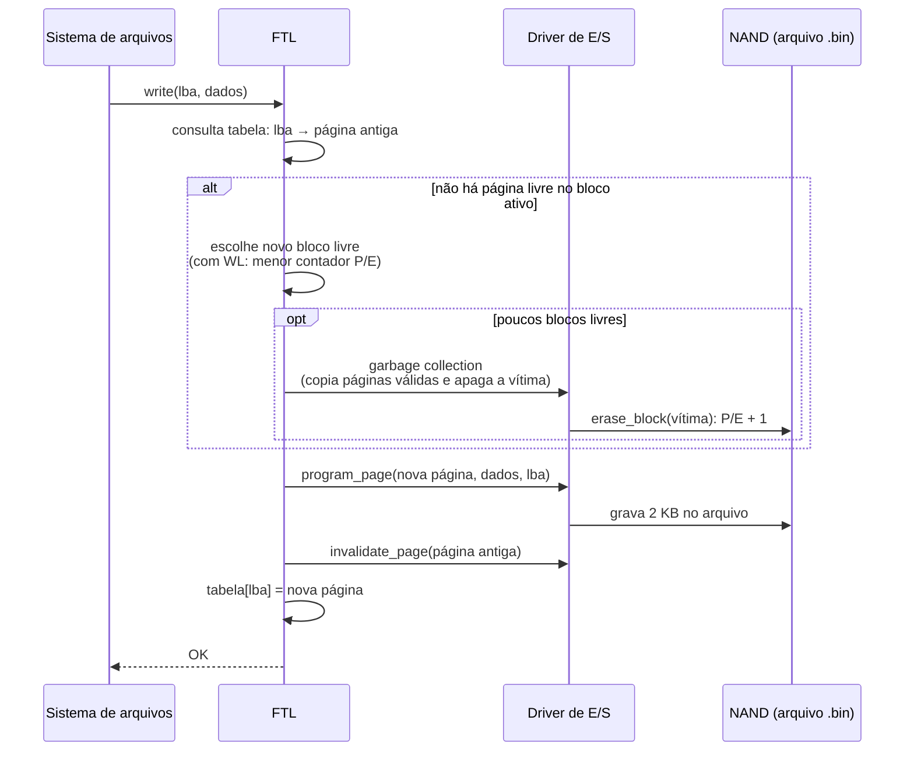
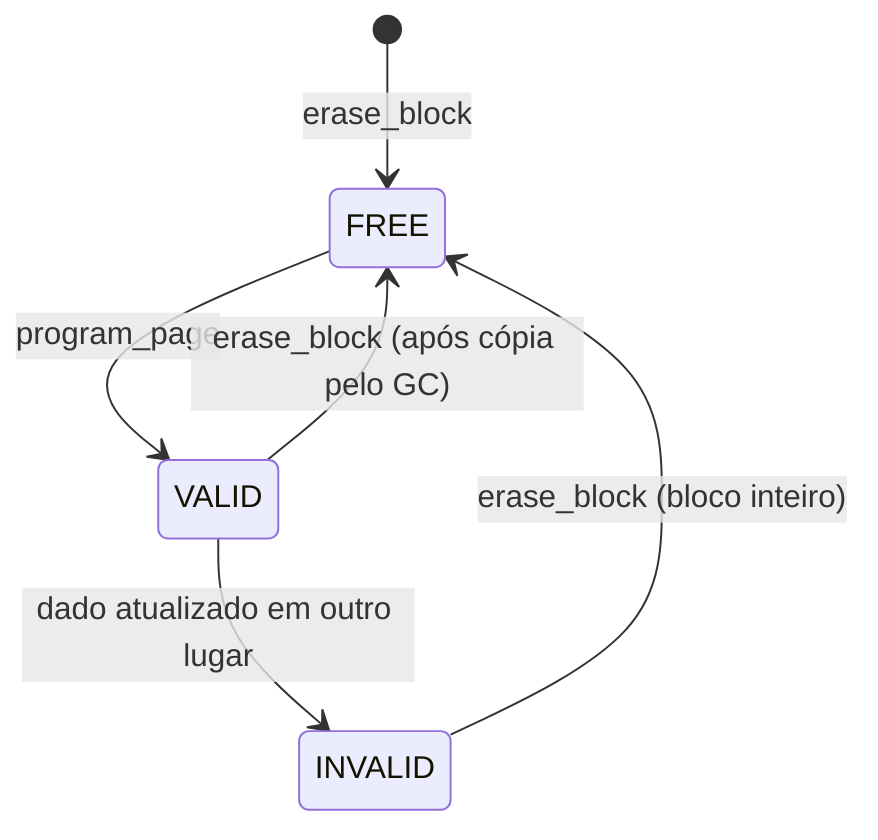

# Etapa 1: Arquitetura do simulador

Os requisitos estão em [01-requisitos.md](01-requisitos.md). Os diagramas abaixo usam Mermaid,
que o GitHub desenha automaticamente; para o artigo, eles podem ser exportados como imagem
em <https://mermaid.live>.

## 1. Camadas

Cada camada só usa a camada imediatamente abaixo. Assim, trocar o modo da FTL (direto,
com mapeamento ou com wear leveling) não muda nada no sistema de arquivos nem no driver.



*Figura sugerida para o artigo: "Arquitetura em camadas do simulador".*

## 2. Responsabilidade de cada camada

| Camada | Arquivo | Conhece | Não conhece |
|---|---|---|---|
| Física NAND | `NANDFlash.hpp` | Blocos, páginas, ciclos P/E, arquivo binário | LBAs, arquivos |
| Driver de E/S | `IODriver.hpp` | Regras da Flash (não sobrescrever, não usar bad block), contadores de operações | Mapeamento, arquivos |
| FTL | `FTL.hpp` e implementações | LBA → PBA, blocos livres, GC, desgaste | Nomes de arquivos, diretórios |
| Sistema de arquivos | `SimpleFS.hpp` | Arquivos, diretório, tabela de alocação, LBAs | Blocos e páginas físicas |
| Shell | `Shell.hpp` | Comandos do usuário | Detalhes internos das camadas |

## 3. Interfaces planejadas

Assinaturas previstas, em C++. Podem mudar durante a implementação, e as mudanças serão
registradas nas anotações do artigo.

```cpp
// Endereço físico de uma página (PBA)
struct PhysicalAddress { uint32_t block; uint32_t page; };

// Driver de E/S (Etapa 3)
class IODriver {
public:
    IOResult read_page(PhysicalAddress pba, uint8_t* buffer);
    IOResult program_page(PhysicalAddress pba, const uint8_t* data, uint32_t lba);
    IOResult invalidate_page(PhysicalAddress pba);
    EraseResult erase_block(uint32_t block);
    const NANDBlock& block_info(uint32_t block) const;
    const IOStats& stats() const; // leituras, programações e apagamentos
};

// Interface comum a todos os modos da FTL (Etapas 4, 5 e 6)
class FTL {
public:
    virtual ~FTL() = default;
    virtual FTLResult write(uint32_t lba, const uint8_t* data) = 0;
    virtual FTLResult read(uint32_t lba, uint8_t* buffer) = 0;
    virtual const char* name() const = 0;
    uint32_t logical_capacity() const; // 7680 LBAs
};

class DirectFTL : public FTL { /* Etapa 4: LBA = PBA */ };
class PageMappingFTL : public FTL {  /* Etapas 5 e 6 */
    // wear_leveling = false: escolhe o próximo bloco livre
    // wear_leveling = true : escolhe o bloco livre com menor P/E
    PageMappingFTL(IODriver& driver, bool wear_leveling);
};
```

O sistema de arquivos recebe uma referência `FTL&`. Por isso, o mesmo cenário de carga roda
nos três modos sem nenhuma alteração, o que garante uma comparação justa.

## 4. Os três modos da FTL

| Modo | Como uma alteração é gravada | Apagamentos por alteração | Papel na pesquisa |
|---|---|---|---|
| Direto (LBA = PBA) | Lê o bloco inteiro, apaga e regrava no mesmo lugar | 1 por alteração | Cenário sem nivelamento |
| Mapeamento sem WL | Grava em página livre nova; GC escolhe blocos livres em ordem | Poucos (só no GC) | Isola o efeito do mapeamento |
| Mapeamento com WL | Igual ao anterior, mas o bloco livre escolhido é o de menor P/E | Poucos, bem distribuídos | Cenário com nivelamento |

No modo direto, o LBA vira endereço físico por divisão: `bloco = lba / 64` e `página = lba % 64`.

## 5. Fluxo de uma escrita no modo com mapeamento



*Figura sugerida para o artigo: "Fluxo de escrita na FTL com mapeamento de páginas".*

## 6. Políticas escolhidas

- **Garbage collection:** guloso (greedy). A vítima é o bloco cheio com mais páginas inválidas.
  É disparado quando restam menos de 2 blocos livres, sempre deixando 1 bloco livre para a cópia.
- **Wear leveling dinâmico:** entre os blocos livres, escolhe o de menor contador de P/E.
- **Wear leveling estático (opcional):** se `P/E máximo − P/E mínimo` passar de um limite (inicialmente 50),
  os dados do bloco menos desgastado são copiados para um bloco livre desgastado.
- **Bad block:** sai da lista de blocos livres e nunca mais é usado. O dispositivo chega ao fim de vida
  quando não há blocos livres suficientes para o GC.

## 7. Estado de uma página



## 8. Organização dos arquivos

```
Projeto-Integrador-IV/
├── NANDFlash.hpp        Etapa 2: camada física
├── IODriver.hpp         Etapa 3: driver de E/S
├── FTL.hpp              Etapas 4 a 6: interface e modos da FTL
├── SimpleFS.hpp         Etapa 7: sistema de arquivos mínimo
├── Shell.hpp            Etapa 8: shell interativo
├── Metrics.hpp          Etapa 9: métricas e exportação CSV
├── main.cpp             ponto de entrada
├── tests/               um programa de teste por camada (make test)
└── docs/                requisitos, arquitetura e anotações do artigo
```

Os arquivos ficam como headers (`.hpp`) para manter o build simples (um único `g++ main.cpp`),
como já é feito hoje com o `NANDFlash.hpp`.

## 9. Métricas (definições)

- **Desvio padrão dos apagamentos:** σ = √( Σ (Pᵢ − P̄)² / N ), onde Pᵢ é o contador de P/E do bloco *i*
  e N é o número de blocos. Quanto menor, mais uniforme o desgaste.
- **Primeira falha:** número de escritas lógicas (pedidas pelo sistema de arquivos) até o primeiro bloco virar bad block.
- **Amplificação de escrita:** páginas programadas fisicamente ÷ escritas lógicas.
